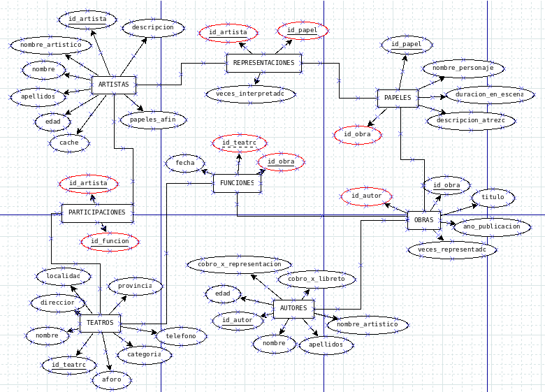

# Proyecto final

Plantilla para el proyecto final.

## Requisitos

- python
- mariadb

## USO

Para crear las tablas y llenarlas con informacion, realizar lo siguiente:

1. Lavantar las la base de datos. Si se esta usando xampp, escribir en la
consola lo siguiente:

```bash
sudo /opt/lampp/lampp start
```

2. Una vez inicializado xampp, procedemos a instalar las dependencias de python

```bash
# Debemos ingresar al directorio del proyecto
cd /path/to/db-project

# despues creamos un entoro virtual con python y activarlo
python3 -m venv .venv

source ./.venv/bin/activate

# instalamos los paquetes necesarios 
python3 -m pip install -r requirements.txt
```

3. exportamos la variables de entorno que contienen el usuario y la contrasena
de nuestra base de datos

```bash
export username="insetaelusuario"
export password="insetalacontrasena"
```

4. corre el programa

```bash
python3 main.py
```

## Diagrama


